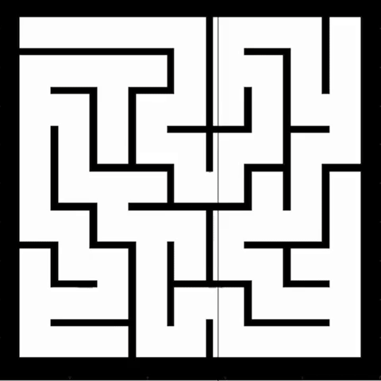
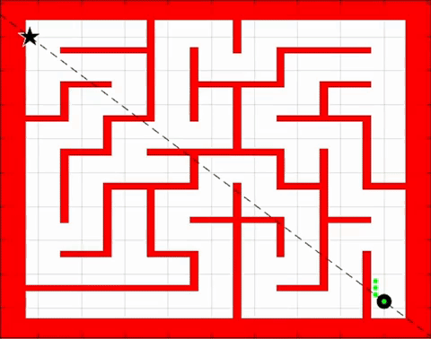
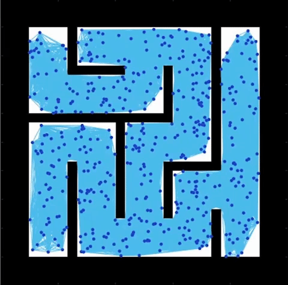
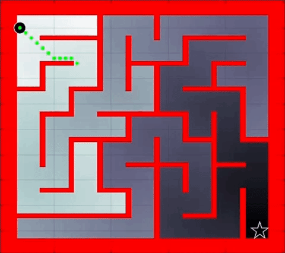
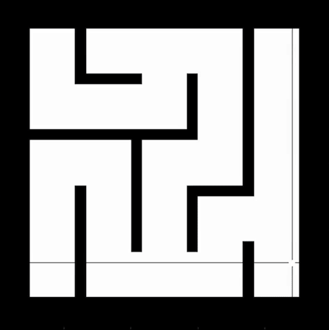

# Navigating through a maze
Demostration of the versatility of various path planning algorithms in MATLAB.

## ⚙️ Setup
Ensure MATLAB installed along with robotics toolbox and navigation toolbox.

## :joystick: Simulation

  
  
  
  
  
  

 
